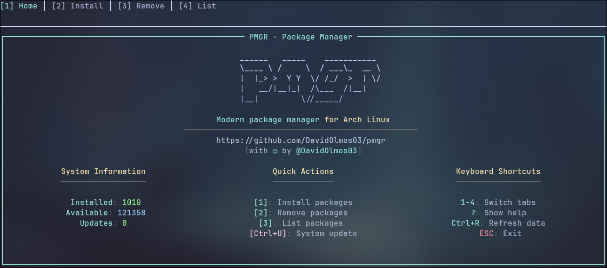
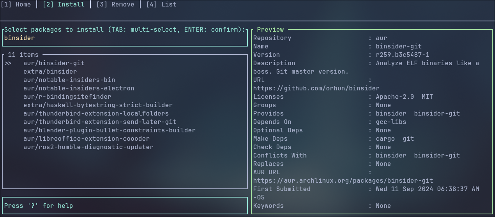
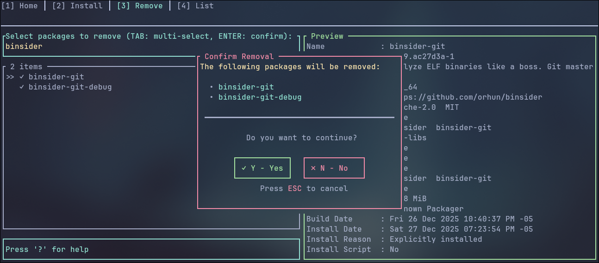
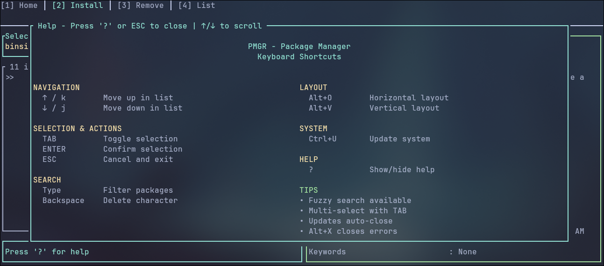

# PMGR - Modern Package Manager TUI

A modern, interactive Terminal User Interface (TUI) package manager for Arch Linux built with Rust. Features a beautiful tabbed interface, fuzzy search, live previews, and seamless package management.


## ✨ Features

- 🎨 **Beautiful TUI Interface** - Tab-based navigation with a modern, polished design
- 🔍 **Fuzzy Search** - Instant fuzzy finding for packages as you type
- 👁️ **Live Previews** - Real-time package information display
- ⚡ **Fast & Responsive** - Built in Rust for maximum performance
- 🎯 **Multi-Select** - Select and manage multiple packages at once
- 🔄 **Interactive Operations** - Full terminal interaction for package installation/removal
- 🎹 **Keyboard-Driven** - Efficient keyboard shortcuts for power users
- 📦 **System Updates** - One-key system update functionality

## 📸 Screenshots

### Main Menu
<!-- Screenshot showing the home view with system statistics and quick actions -->


*The main menu displays system information, quick actions, and keyboard shortcuts.*

### Package Installation
<!-- Screenshot showing the install view with package list and preview panel -->


*Browse and search through thousands of packages with live preview of package details.*

### Confirmation Dialog
<!-- Screenshot showing the confirmation dialog when removing packages -->


*Clear confirmation dialogs with package details before any destructive operations.*

### Keyboard Shortcuts
<!-- Screenshot showing the help screen with all available shortcuts -->


*Comprehensive help screen accessible with '?' key showing all available commands.*

## 🚀 Installation

### Prerequisites

- Arch Linux (or Arch-based distribution)
- Rust toolchain (1.70 or later)
- `yay` or `pacman` package manager

### Build from Source

```bash
# Clone the repository
git clone https://github.com/DavidOlmos03/pmgr.git
cd pmgr

# Build the release binary
cargo build --release

# Install to your PATH
sudo cp target/release/pmgr /usr/local/bin/

# Or use cargo install
cargo install --path .
```

## 📖 Usage

### Interactive Menu Mode

Simply run `pmgr` without arguments to launch the interactive TUI:

```bash
pmgr
```

Navigate through tabs using number keys (1-4) or arrow keys.

### Direct Commands

You can also use direct commands for specific operations:

```bash
# Install packages
pmgr install firefox chromium

# Remove packages
pmgr remove package-name

# Search for packages
pmgr search firefox

# List installed packages
pmgr list --interactive
```

## ⌨️ Keyboard Shortcuts

### Global Navigation

| Key | Action |
|-----|--------|
| `1-4` | Switch between tabs (Home, Install, Remove, List) |
| `?` | Show help screen |
| `Ctrl+U` | Run system update |
| `Ctrl+R` | Refresh current view data |
| `ESC` | Go back / Exit |

### Package Selection

| Key | Action |
|-----|--------|
| `↑/↓` or `j/k` | Navigate through packages |
| `TAB` | Select/deselect package (multi-select) |
| `Enter` | Confirm selection |
| `Type` | Fuzzy search filter |
| `Backspace` | Clear search |

### Preview Layout

| Key | Action |
|-----|--------|
| `Alt+O` | Toggle vertical layout |
| `Alt+V` | Toggle horizontal layout |

### In Dialogs

| Key | Action |
|-----|--------|
| `Y` / `Enter` | Confirm action |
| `N` / `ESC` | Cancel action |
| `↑/↓` | Scroll content |


## 🤝 Contributing

Contributions are welcome! Feel free to:

- Report bugs
- Suggest new features
- Submit pull requests
- Improve documentation

## 📄 License

This project is licensed under the MIT License - see the [LICENSE](LICENSE) file for details.

## 👨‍💻 Author

**David Olmos**
- GitHub: [@DavidOlmos03](https://github.com/DavidOlmos03)

## 🙏 Acknowledgments

- Built with ♥ using Rust
- Inspired by modern TUI applications like `lazygit` and `bottom`
- Thanks to the Arch Linux community

---

**Important Note**: This tool is specifically designed for Arch Linux and requires `yay` or `pacman` to be installed.
